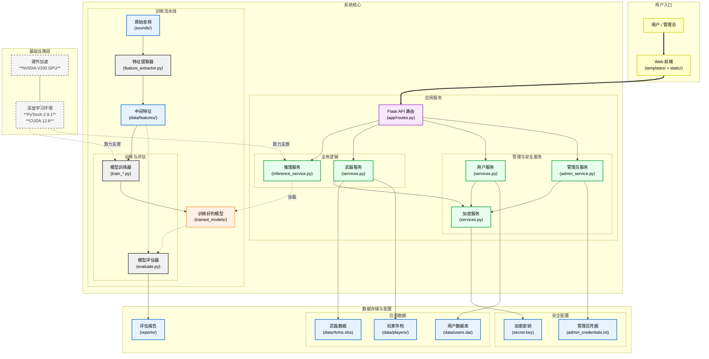
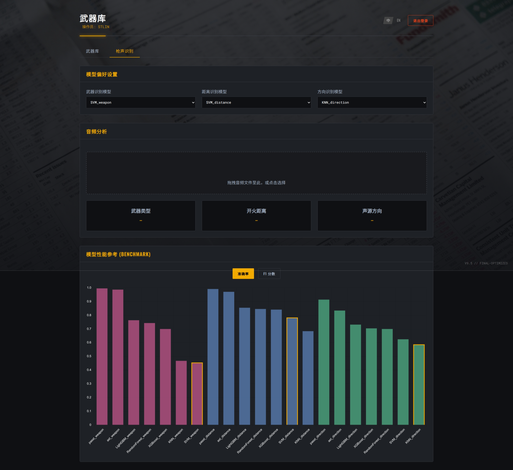
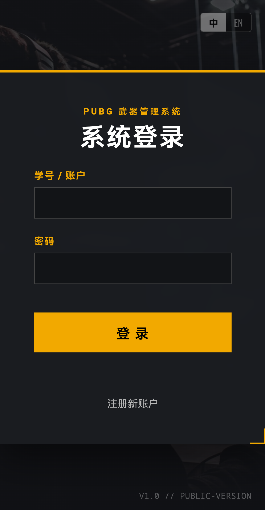
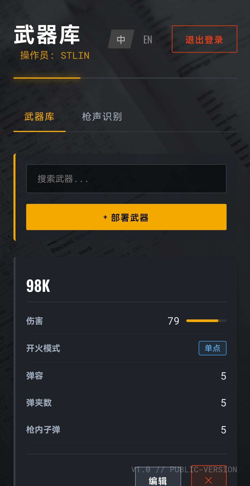
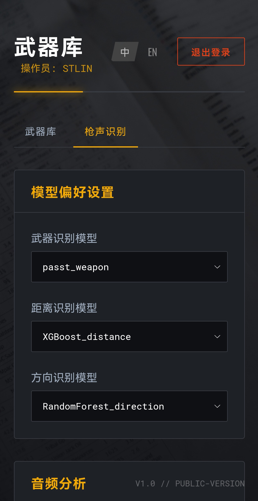

# PUBG 武器管理与声音识别综合系统

本项目是一个集成的课程设计实践，巧妙地融合了两个核心模块：一个功能完备的 **Web 武器管理系统** 和一个高性能的 **武器声音识别机器学习流水线**。项目不仅涵盖了从后端开发、前端交互到数据加密的全栈技术，还深入探索了从传统机器学习到前沿深度学习模型的构建、训练与评估。

---

## 文档中心

本文档是项目的**快速指南**。为了更深入地了解特定模块，请参阅以下专业文档：

*   **[模型成果报告](SOUNDS_REPORT.md)**: 查看我们最终的模型性能对比、数据分析和项目结论。
*   **[模型训练指南](sounds_model_GUIDE.md)**: 了解如何设置环境、训练和评估所有模型。
*   **[Web应用技术文档](WEAPON_SYSTEM_GUIDE.md)**: 了解Web应用的架构和运行方式。
*   **[课程设计报告](tex/main.pdf)**: 查看《程序设计基础》课程期末报告。

---

## 系统架构总览



---

## 核心亮点

### 成果：双声道PaSST模型
本项目最核心的技术创新在于，我们没有止步于使用现有的音频识别模型，而是针对性地解决了**声音方位识别**这一关键难题。

*   **技术洞察**: 传统的单声道音频模型因缺少空间信息，无法有效区分声音的左右来源。
*   **解决方案**: 我们对先进的 **PaSST (Patch Audio Spectrogram Transformer)** 模型的底层结构进行了改造，使其能够**同时处理双声道（Stereo）音频**，从而有效学习到决定声音空间感的**双耳时间差**和**双耳强度差**等关键特征。
*   **卓越性能**: 这一创新取得了巨大成功。改造后的模型在最具挑战的**方向识别**任务上，准确率飙升至 **91.6%**，以绝对优势超越了所有基线模型，是项目成功的关键。


### 应用功能亮点
*   **企业级 Web 架构**: 采用 Flask 应用工厂模式和蓝图，实现高度模块化与可扩展性。
*   **全功能武器库**: 为用户提供对武器数据的增、删、改、查 (CRUD) 功能。
*   **在线枪声识别**: 允许用户上传音频，选择不同模型进行**实时推理**，并提供可视化的模型性能 Benchmark。
*   **强大的管理员后台**: 独立的管理面板，可实时监控站点数据、查看日志、管理用户和**动态调整模型缓存策略**。
*   **坚固的安全机制**: 用户数据和玩家存档均采用 AES **全加密**存储。
*   **现代化前端体验**: 所有模块均采用响应式布局，完美适配桌面与移动端，并包含数据排序、自定义模态框等高级交互。

### 科学的ML流水线
*   **高精度多维识别**: 能从音频中准确识别**武器类型**、**开火距离**和**声源方向**三大核心信息。
*   **模块化科学流程**: 实现了从数据处理、特征工程到模型训练、批量评估和结果可视化的完整、可复现流水线。

---

## 成果界面展示

我们为PC和移动端都提供了精心设计的响应式界面，确保在任何设备上都有一致的优质体验。

<table width="100%" cellpadding="2">
    <thead>
        <tr>
            <th align="center">用户武器库</th>
            <th align="center">枪声识别</th>
            <th align="center">管理面板</th>
        </tr>
    </thead>
    <tbody>
        <tr>
            <td align="center"></td>
            <td align="center"></td>
            <td align="center"></td>
        </tr>
    </tbody>
</table>

<table width="100%" cellpadding="2">
    <thead>
        <tr>
            <th align="center">登录</th>
            <th align="center">武器库</th>
            <th align="center">枪声识别</th>
            <th align="center">管理面板</th>
        </tr>
    </thead>
    <tbody>
        <tr>
            <td align="center"></td>
            <td align="center"></td>
            <td align="center"></td>
            <td align="center"></td>
        </tr>
    </tbody>
</table>

---

## 环境设置

项目依赖 Python 3.10+ 环境。推荐使用 Conda 创建独立的虚拟环境。

1.  **创建并激活 Conda 环境**:
    ```bash
    conda create -n pubg_system python=3.10
    conda activate pubg_system
    ```

2.  **安装依赖**:
    ```bash
    pip install -r requirements.txt
    ```
    > **注意**: 为了使用GPU加速，请确保您已正确安装 NVIDIA 驱动和 CUDA Toolkit，并安装 PyTorch 的 CUDA 版本。

---

## 运行指南

### 模块一：Web 应用 (在线服务)

1.  **启动服务**: 在项目根目录下运行：
    ```bash
    python3 run.py
    ```
2.  **访问应用**:
    *   **普通用户**: 打开浏览器并访问 `http://127.0.0.1:5000/`。
    *   **管理员**: 使用 `admin_credentials.txt` 中定义的凭据在登录页面登录，将自动重定向到 `/admin`。

### 模块二：声音识别系统 (模型训练)

这是一个用于**训练和评估**模型的离线流水线。请在项目根目录下按顺序执行。

**第一步: 特征提取 (仅传统模型需要)**
```bash
python -m src.sound_recognition.feature_extractor
```

**第二步: 模型训练 (示例)**
```bash
# 训练 RandomForest 来预测 weapon
python -m src.sound_recognition.train --model RandomForest --target weapon

# 微调双声道 PaSST 模型来预测 direction
python -m src.sound_recognition.train_passt --target direction --epochs 10
```
> **提示**: 我们提供了一个方便的批量训练脚本 `all_train_and_eval.sh`，它会训练所有预设的模型。您可以直接运行 `bash all_train_and_eval.sh`。

**第三步: 综合评估**
```bash
python -m src.sound_recognition.evaluate
```
评估结果将保存在 `reports/evaluation_results.csv`。如果您运行 `all_train_and_eval.sh` 脚本，其最终输出将如下图所示，包含了所有模型的评估结果和总运行时间：


---

## 项目结构

```
.
├── app/                  # [核心] Web应用核心包
│   ├── static/           # CSS, JS, Images
│   ├── templates/        # HTML 模板
│   ├── __init__.py       # 应用工厂, 创建app实例
│   ├── routes.py         # 路由层 (API Endpoints)
│   ├── services.py       # 用户与武器业务逻辑
│   ├── admin_service.py  # 管理员认证服务
│   └── inference_service.py # [核心] 模型推理服务
├── data/                 # 用户数据与初始数据
├── src/                  # [核心] 声音识别训练流水线
│   └── sound_recognition/
├── reports/              # 评估报告与图表
├── trained_models/       # 训练好的模型文件
├── admin_credentials.txt # 管理员凭据 (默认: admin:admin)
├── cache_strategy.json   # 模型缓存策略配置
├── app.log               # 应用日志文件
├── models.py             # 数据模型 (Weapon, Player)
├── run.py                # [入口] Web应用启动脚本
├── version.txt           # 全局版本号文件
└── README.md             # 本文档
```