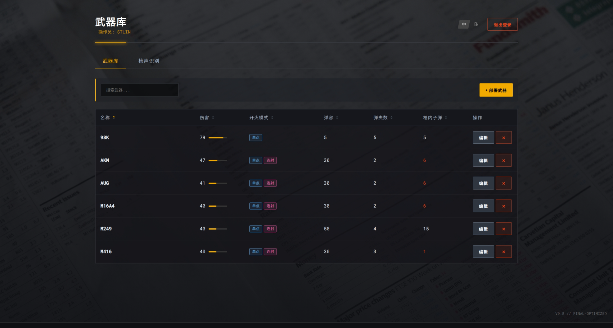
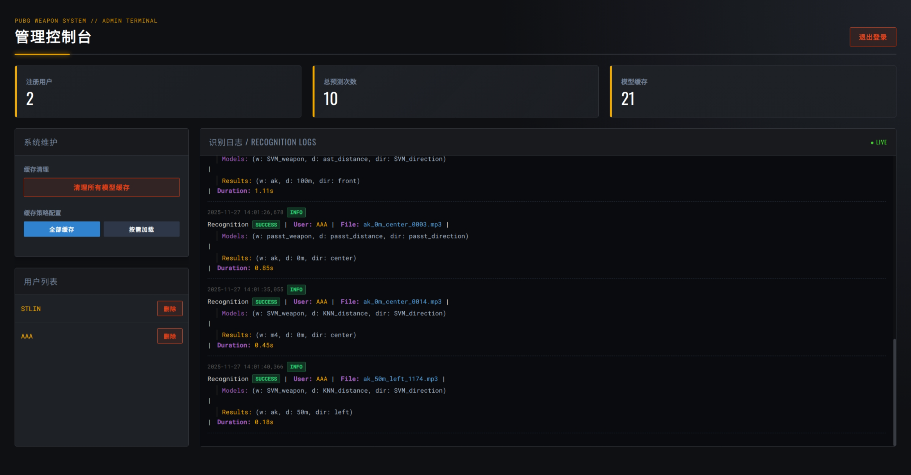

# PUBG 武器管理与声音识别综合系统

本项目是一个集成的课程设计实践，巧妙地融合了两个核心模块：一个功能完备的 **Web 武器管理系统** 和一个高性能的 **武器声音识别机器学习流水线**。项目不仅涵盖了从后端开发、前端交互到数据加密的全栈技术，还深入探索了从传统机器学习到前沿深度学习模型的构建、训练与评估。

---

## 🚀 核心功能亮点

### Web 应用
*   **企业级 Web 架构**: 采用 Flask 应用工厂模式和蓝图（Blueprints），实现高度模块化与可扩展性。
*   **全功能武器库**: 为普通用户提供对武器数据的增、删、改、查 (CRUD) 功能。
*   **在线枪声识别**: 允许用户上传音频文件，选择不同的预训练模型进行**实时推理**，并以可视化的方式展示识别结果和模型性能 Benchmark。
*   **强大的管理员后台**: 提供独立的管理员登录和专属仪表盘，可实时监控站点数据、查看日志、管理用户和调整模型缓存策略。
*   **坚固的安全机制**: 用户名、密码和武器库数据均采用 AES (GCM 模式) **全加密**存储。
*   **现代化前端体验**:
    *   支持中/英文双语切换。
    *   所有模块均采用响应式布局，适配桌面与移动端。
    *   包含数据排序、自定义模态框等高级交互功能。

### 武器声音识别系统
*   **高精度多维识别**: 能从音频中准确识别**武器类型**、**开火距离**和**声源方向**。
*   **前沿模型应用**: 系统性地评估了多种传统模型，并创新性地微调了两种先进的 Transformer 模型 (AST 和 PaSST)。
*   **突破性成果**:
    *   经过**双声道改造**的 PaSST 模型在所有任务中均表现最佳。
    *   尤其在最具挑战的**方向识别**任务上，PaSST 模型准确率高达 **91.6%**，显著超越其他所有模型。
*   **模块化科学流程**: 实现了从数据处理、特征工程到模型训练、批量评估和结果可视化的完整、可复现流水线。

---

## 📊 最终成果展示

### 武器声音识别模型性能总览
下图清晰地展示了，在所有三个识别任务中，我们所采用的 Transformer 模型（尤其是经过双声道改造的 PaSST）性能远超所有传统机器学习基线模型。


### 网页界面




---

## 🛠️ 环境设置

项目依赖 Python 3.10+ 环境。推荐使用 Conda 创建独立的虚拟环境以保证环境纯净。

1.  **创建并激活 Conda 环境**:
    ```bash
    conda create -n pubg_system python=3.10
    conda activate pubg_system
    ```

2.  **安装依赖**:
    项目的所有依赖项都已整合到 `requirements.txt` 文件中。请运行以下命令进行安装：
    ```bash
    pip install -r requirements.txt
    ```
    > **注意**: 声音识别系统为了使用 CUDA 加速，请确保您已正确安装 NVIDIA 驱动和 CUDA Toolkit，并建议安装 PyTorch 的 CUDA 版本。

---

## 模块一：🔫 Web 应用

### 简介
这是一个基于 Flask 的多功能 Web 应用，集成了**武器管理**、**在线枪声识别**和**后台管理**三大模块。

### ▶️ 如何运行

1.  **确保依赖已安装**: `pip install -r requirements.txt`
2.  **启动服务**: 在项目根目录下运行：
    ```bash
    python3 run.py
    ```
3.  **访问应用**:
    *   **普通用户**: 打开浏览器并访问 `http://127.0.0.1:5000/`。您可以注册新用户或使用已有用户登录。
    *   **管理员**: 使用 `admin_credentials.txt` 中定义的凭据在登录页面登录，您将被自动重定向到 `/admin` 管理面板。

---

## 模块二：🔊 武器声音识别系统

### 简介
这是一个模块化的机器学习流水线，用于**训练和评估**声音识别模型。关于如何将训练好的模型部署到 Web 应用中进行**实时推理**，请参阅 Web 应用模块。

### ▶️ 如何运行

整个流程分为三步，请在项目根目录下按顺序执行。

**第一步: 特征提取 (仅传统模型需要)**

此命令会处理 `sounds/` 目录下的所有音频，提取 MFCC 特征，为后续传统模型训练做准备。
```bash
python -m src.sound_recognition.feature_extractor
```

**第二步: 模型训练**

您可以选择性地训练单个或多个模型。以下为几个示例：

```bash
# 示例 1: 训练一个 RandomForest 模型来预测 weapon
python -m src.sound_recognition.train --model RandomForest --target weapon

# 示例 2: 训练一个 XGBoost 模型来预测 distance (使用 CUDA)
python -m src.sound_recognition.train --model XGBoost --target distance --use_cuda

# 示例 3: 微调 AST 模型来预测 weapon (训练 10 个 epoch)
python -m src.sound_recognition.train_ast --target weapon --epochs 10

# 示例 4: 微调我们改造后的双声道 PaSST 模型来预测 direction
python -m src.sound_recognition.train_passt --target direction --epochs 10
```
> 我们提供了一个方便的批量训练脚本 `all_train_and_eval.sh`，它会训练所有预设的模型。您可以直接运行 `bash all_train_and_eval.sh`。


**第三步: 综合评估**

当您训练完所有希望对比的模型后，运行此脚本。它会自动评估所有已保存的模型，并生成最终的性能报告 `reports/evaluation_results.csv` 和对比图。
```bash
python -m src.sound_recognition.evaluate
```

---

## 📁 项目结构

```
.
├── app/                  # Web应用核心包
│   ├── templates/        # HTML 模板 (dashboard.html, admin.html, ...)
│   ├── __init__.py       # 应用工厂, 注册蓝图
│   ├── routes.py         # 路由层 (main_bp, admin_bp)
│   ├── services.py       # 用户与武器业务逻辑
│   ├── admin_service.py  # 管理员认证服务
│   └── inference_service.py # 模型推理服务
├── data/                 # 持久化数据
├── src/                  # 声音识别训练流水线核心代码
│   └── sound_recognition/
├── reports/              # 评估报告与图表
├── trained_models/       # 训练好的模型
├── admin_credentials.txt # 管理员凭据
├── cache_strategy.json   # 缓存策略配置
├── app.log               # 应用日志文件
├── models.py             # 数据模型 (Weapon, Player)
├── run.py                # Web应用启动入口
├── version.txt           # 全局版本号文件
└── README.md             # 本文档