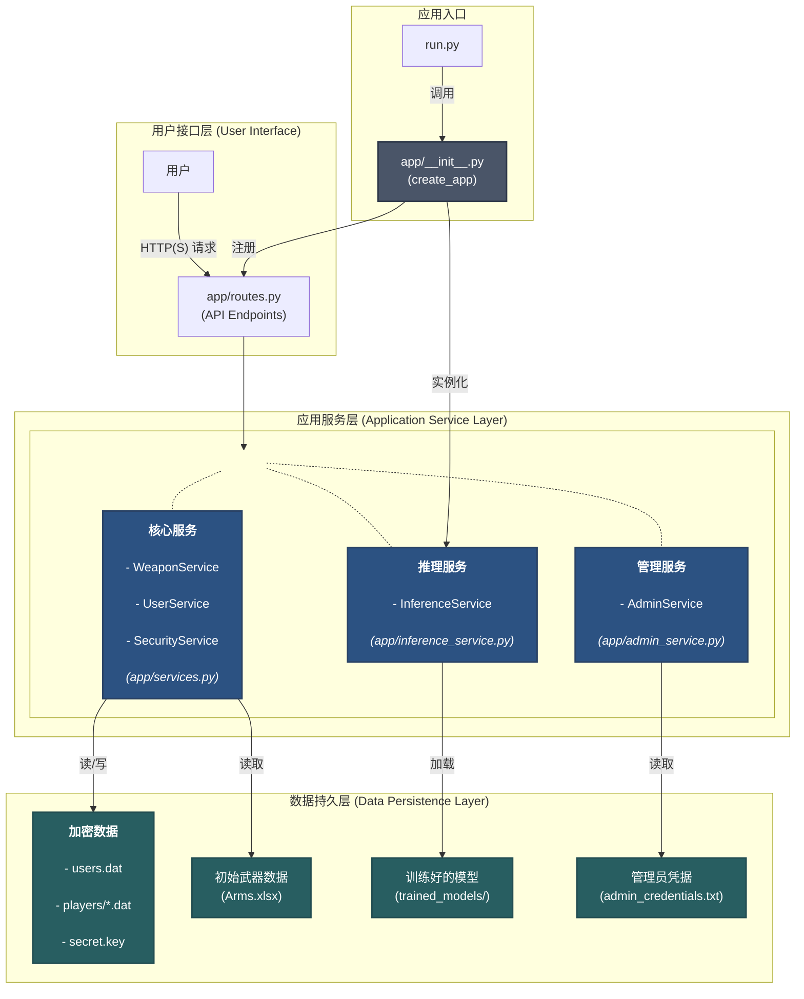

# Web 应用技术文档

本文档是 PUBG 武器管理与声音识别系统的官方技术说明，旨在为开发者和维护者提供对系统架构、核心组件和运行方式的全面理解。

## 1. 系统架构概述

本系统采用基于 **Flask 的应用工厂模式 (Application Factory Pattern)** 构建，这是一种高度模块化、可扩展的 Web 应用架构。该模式将应用创建、配置和服务注册封装在一个函数中，有效避免了循环依赖问题，并提升了代码的可维护性和可测试性。

### 1.1 架构图

### 1.2 核心组件职责

*   **`run.py`**: **应用入口点**。调用 `app` 包中的 `create_app` 工厂函数来获取一个配置好的 Flask 应用实例，并启动服务器。
*   **`app/` (应用包)**:
    *   **`__init__.py`**: 定义 **`create_app()` 工厂函数**。负责实例化 `Flask` 应用，并注册 `main_bp` 和 `admin_bp` 两个蓝图。
    *   **`routes.py`**: **路由与视图层**。包含两个蓝图：
        *   `main_bp`: 处理所有普通用户的请求，包括页面渲染、武器管理 API 和枪声识别 API。
        *   `admin_bp`: 处理所有管理员相关的 API 请求，并受到 `admin_required` 装饰器的保护。
    *   **`services.py`**: **核心用户业务逻辑层**。封装了 `SecurityService`, `UserService`, 和 `WeaponService`。
    *   **`inference_service.py`**: **核心推理业务逻辑层**。负责动态加载、缓存和执行所有机器学习模型。
    *   **`admin_service.py`**: **管理员认证服务**。负责从 `admin_credentials.txt` 读取凭据并验证管理员身份。
    *   **`templates/`**: **前端视图层**。包含 `dashboard.html` (用户仪表盘) 和 `admin.html` (管理面板)。
*   **`models.py`**: **业务模型层**。定义了 `Weapon` 和 `Player` 两个核心业务逻辑类，主要由 `services.py` 调用以管理玩家状态和武器库，与模型推理服务无直接关系。`Player` 模型现在也包含了 `model_preferences` 字段。
*   **`admin_credentials.txt`**: 以 `username:password` 格式存储管理员的凭据。
*   **`cache_strategy.json`**: 以 JSON 格式持久化存储管理员设定的模型缓存策略。
*   **`app.log`**: 记录所有枪声识别操作的结构化日志文件。

## 2. 功能与技术实现

### 2.1 用户与管理员认证

*   **登录 (`/api/login`)**: 登录流程现在被分为两步：
    1.  首先，使用 `AdminService` 检查用户凭据是否匹配 `admin_credentials.txt` 中的管理员账户。如果匹配，则返回 `is_admin: true` 标志和指向 `/admin` 的重定向。
    2.  如果不是管理员，则继续执行原有的普通用户加密验证流程。
*   **管理员 API 保护**: 所有在 `admin_bp` 蓝图下的 API 端点都由 `@admin_required` 装饰器保护，该装饰器会验证请求头中的管理员凭据。

### 2.2 用户仪表盘 (`/dashboard`)

*   **双模块设计**: 仪表盘现在包含 "武器库" 和 "枪声识别" 两个可通过 Tab 切换的模块。
*   **枪声识别模块**:
    *   **模型选择**: 用户可以为 `weapon`, `distance`, `direction` 三个任务分别选择要使用的识别模型。用户的选择会被持久化保存在其个人数据中。
    *   **文件上传**: 提供一个支持拖拽和点击上传的区域，用于提交音频文件进行分析。
    *   **实时推理**: 上传后，前端会调用 `/api/recognize` API，后端 `InferenceService` 会实时加载（或从缓存中读取）所选模型，对音频进行特征提取和推理，并返回三个任务的预测结果。
    *   **Benchmark 可视化**: 页面会调用 `/api/benchmark` API 获取所有模型的性能数据（准确率和 F1 分数），并使用 Chart.js 将其渲染为条形图。图表支持指标切换，并能高亮显示用户当前选择的模型。

### 2.3 管理面板 (`/admin`)

*   **数据看板**: 提供一个集中的仪表盘，用于展示核心站点统计数据，如总用户数、总预测次数和当前缓存的模型数量。
*   **用户管理**: 管理员可以查看所有已注册用户的列表，并通过一个自定义的确认模态框来安全地删除任何用户及其所有数据。
*   **日志查看器**: 内嵌一个可以自动刷新的日志查看器，以 Tag 化的富文本格式实时展示 `app.log` 文件的内容。
*   **缓存管理**: 管理员可以：
    *   一键**清理**所有在内存中的模型缓存。
    *   设置全局的**缓存策略**（全部缓存 vs 按需加载），该策略会持久化保存并在服务器重启后依然生效。

## 3. 运行指南

1.  **环境准备**: 确保已在 `pubg` anaconda 虚拟环境中，并已通过 `pip install -r requirements.txt` 安装所有依赖。
2.  **启动服务**: 在项目根目录下运行 `python3 run.py`。
3.  **访问应用**:
    *   **普通用户**: 打开浏览器并访问 `http://127.0.0.1:5000/` 进行注册或登录。
    *   **管理员**: 使用 `admin_credentials.txt` 中定义的凭据在登录页面登录，您将被自动重定向到 `/admin`。

## 4. 界面展示

本节展示了 Web 应用在 PC 端和移动端上的核心界面截图。

### 4.1 PC 端界面

<table width="100%" cellpadding="2">
    <thead>
        <tr>
            <th align="center">用户武器库</th>
            <th align="center">枪声识别</th>
            <th align="center">管理面板</th>
        </tr>
    </thead>
    <tbody>
        <tr>
            <td align="center"></td>
            <td align="center"></td>
            <td align="center"></td>
        </tr>
    </tbody>
</table>

### 4.2 移动端界面

我们同样对移动端进行了响应式布局优化，确保在小屏幕设备上也能获得良好的用户体验。

<table width="100%" cellpadding="2">
    <thead>
        <tr>
            <th align="center">登录</th>
            <th align="center">武器库</th>
            <th align="center">枪声识别</th>
            <th align="center">管理面板</th>
        </tr>
    </thead>
    <tbody>
        <tr>
            <td align="center"></td>
            <td align="center"></td>
            <td align="center"></td>
            <td align="center"></td>
        </tr>
    </tbody>
</table>