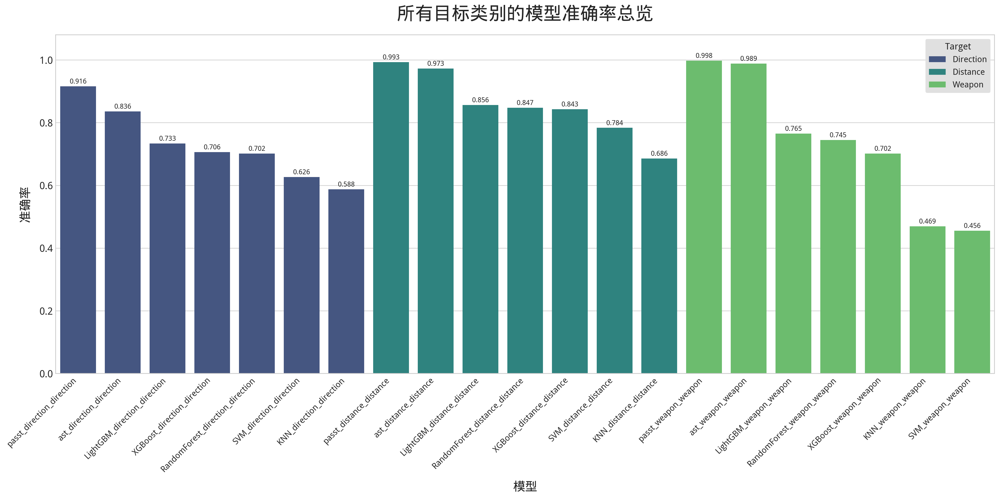
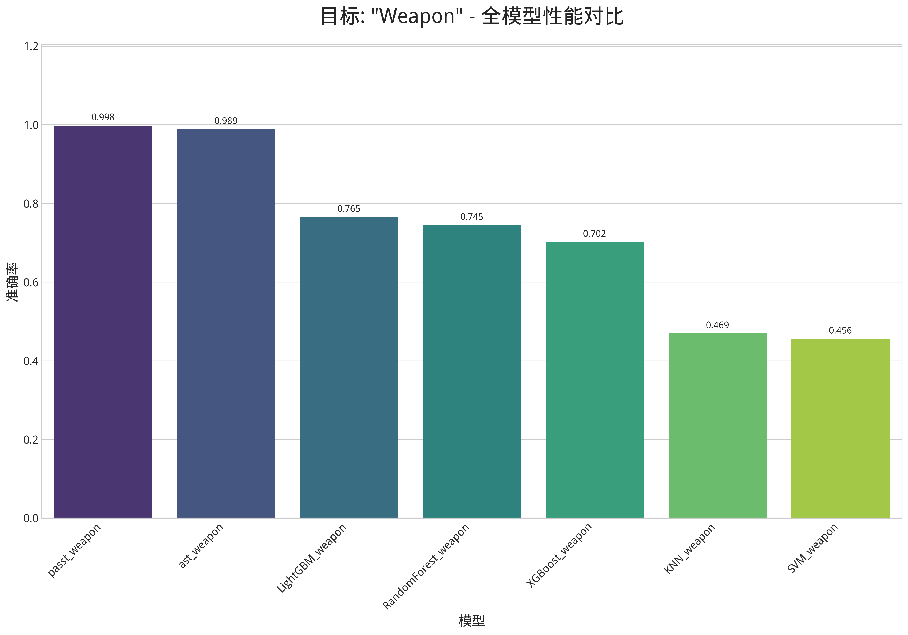
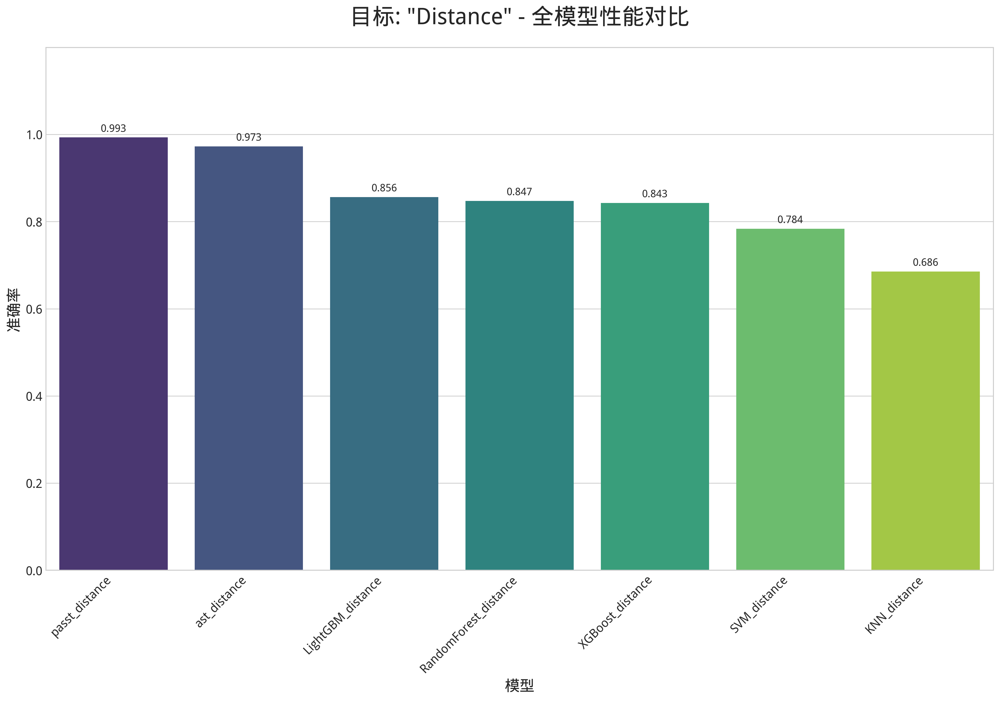
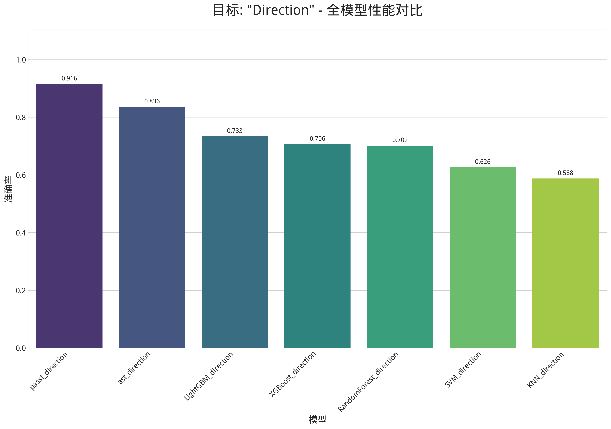
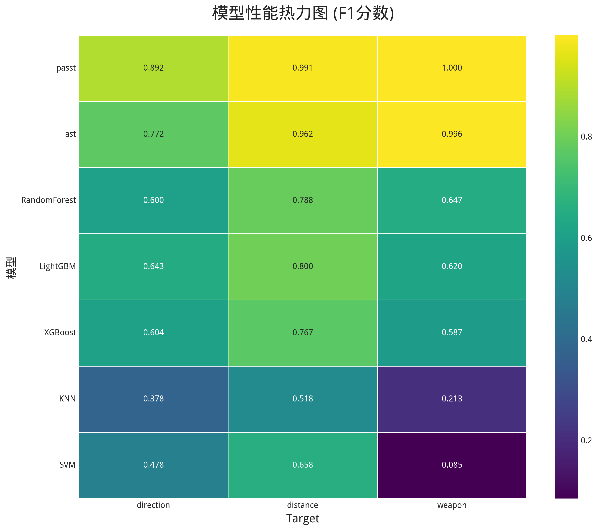
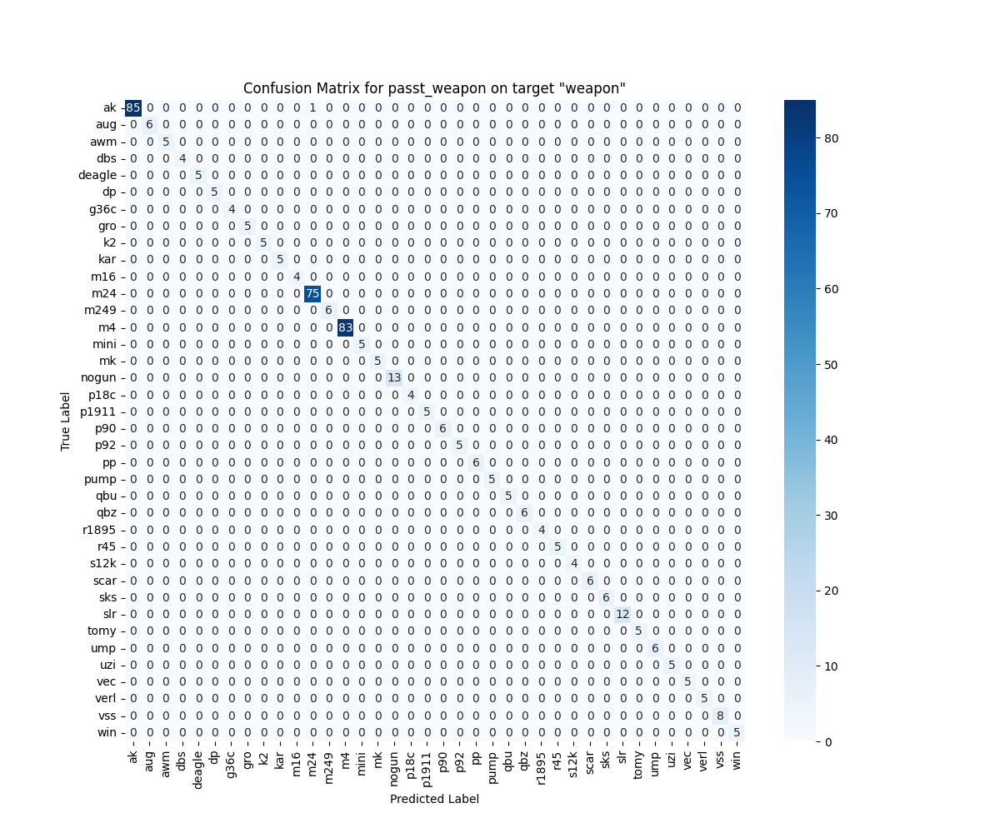
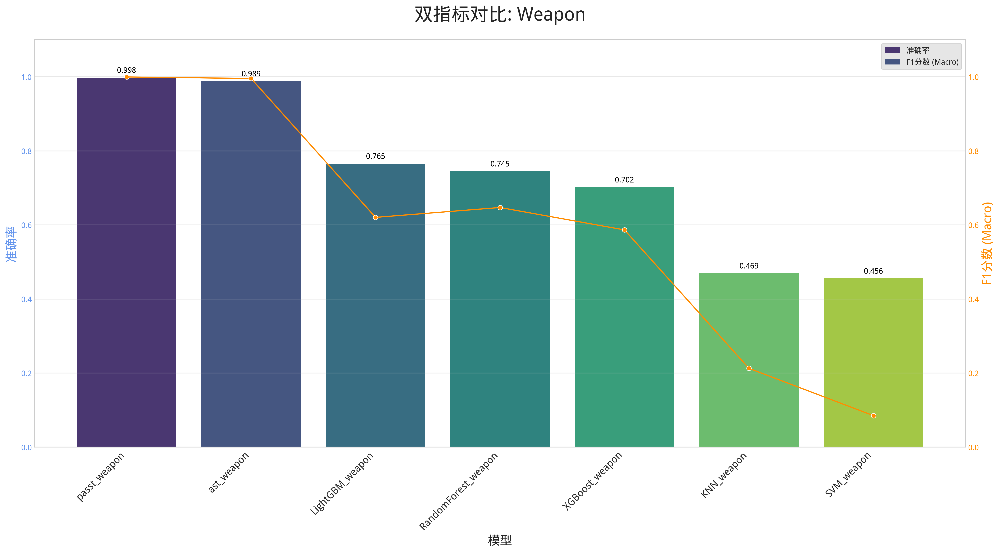

# 武器声音识别模型成果

## 1. 项目目标

本项目旨在构建一个高效的机器学习系统，用于从武器开火的音频片段中，准确识别三个关键信息：
1.  **武器类型 (Weapon)**
2.  **开火距离 (Distance)**
3.  **声源方向 (Direction)**

为了达成此目标，我们采用了一套科学的实验流程，系统地探索、训练并评估了多种传统机器学习模型和两种先进的Transformer深度学习模型。

## 2. 技术流程与架构

我们构建了一个从数据到结论的完整、模块化的流水线，主要分为以下几个阶段：

1.  **数据工程**:
    *   **标签解析**: 脚本 (`dataset.py`) 自动扫描音频文件，并从文件名 (`weapon_distance_direction_id.mp3`) 中解析出三个维度的标签。
    *   **特征提取**: 针对传统模型，我们使用 `feature_extractor.py` 提取MFCC特征，并将其与编码后的标签保存为`.npy`文件，以加速后续训练。

2.  **模型训练**:
    *   **传统模型**: 我们实现了高度灵活的`train.py`脚本，支持对RandomForest, KNN, SVM, XGBoost, LightGBM等多种模型进行训练。
    *   **Transformer模型**: 我们利用Hugging Face Transformers库，实现了对两种先进模型的微调：
        *   `train_ast.py`: 微调 **Audio Spectrogram Transformer (AST)** 模型，它直接处理单声道声谱图。
        *   `train_passt.py`: 微调 **Patch Audio Spectrogram Transformer (PaSST)** 模型，并创新性地改造其以支持**双声道**输入，旨在增强空间（方向）特征的捕捉能力。

3.  **综合评估与可视化**:
    *   我们创建了`evaluate.py`脚本，能够自动发现所有训练好的模型，并在统一的测试集上运行评估。
    *   新增了`visualize_results.py`脚本，它读取评估结果，并自动生成一系列中英文、高分辨率的对比图表，用于最终报告。

## 3. 模型成果与分析

在对所有模型进行完整训练和评估后，我们得到了清晰的、数据驱动的性能排序。下图直观地展示了所有模型在三个目标类别上的准确率表现。

### 核心发现

1.  **Transformer模型展现绝对优势**:
    *   在**所有三个**预测任务上，两种Transformer模型 (`PaSST` 和 `AST`) 的性能都**全面、显著地超越**了所有传统机器学习模型。这证明了端到端深度学习方法在直接从声谱图学习复杂声学特征方面的优越性。

2.  **PaSST模型性能最佳，尤其是在方向识别上**:
    *   **PaSST** 在所有任务中都名列前茅，尤其是在最具挑战性的**方向 (direction)**识别任务上，其准确率达到了 **91.6%**，比次优的AST模型高出8个百分点，更是远超所有传统模型。
    *   这强有力地证明了我们对其进行**双声道改造**的策略是成功的。通过同时处理左、右声道信息，PaSST能够有效学习到声音的时间差（ITD）和强度差（ILD）等关键空间线索。

3.  **各任务性能表现**:
    *   **武器 (weapon) 识别**: PaSST 和 AST 均取得了近乎完美的 **99%** 以上的准确率，表明Transformer模型在该任务上已接近解决。
    *   **距离 (distance) 识别**: PaSST 和 AST 同样表现出色，准确率分别达到 **99.3%** 和 **97.3%**。
    *   **方向 (direction) 识别**: 这是区分度最高的任务。PaSST的卓越表现（91.6%）与其他模型拉开了显著差距，凸显了其作为方向识别最佳模型的地位。

下图分别展示了在三个不同目标上，各类模型的详细性能对比。

| 武器识别对比 | 距离识别对比 | 方向识别对比 |
| :---: | :---: | :---: |
|  |  |  |

### 性能洞察

为了更深入地理解模型的综合性能与具体表现，我们引入了性能热力图和双指标对比图。

#### 模型性能热力图

下图以热力图的形式，直观地展示了所有模型在三个不同任务上的**F1分数**。颜色的亮度与性能正相关（越亮表示性能越好）。

*   **图表解读**：从图中可以清晰地看到，`passt` 和 `ast` 两个模型在所有任务上都处于最亮的（性能最优）区间。与之形成鲜明对比的是，`SVM` 和 `KNN` 模型在 `weapon` 任务上的表现处于深色区域，表明它们在该任务上性能较差。这张图对于快速识别出在特定任务上的优势模型和劣势模型非常有效。

#### PaSST模型详细分析

接下来，我们聚焦于综合表现最佳的 **PaSST** 模型，通过并排展示其在每个任务上的**混淆矩阵**和**双指标（准确率/F1分数）对比图**，来深入分析其具体表现。

 

<table width="100%">
    <thead>
        <tr>
            <th colspan="2" align="center">任务：Weapon (武器) —— PaSST 模型详细表现</th>
        </tr>
    </thead>
    <tbody>
        <tr>
            <td align="center" width="40%"><strong>混淆矩阵</strong></td>
            <td align="center" width="60%"><strong>双指标对比图</strong></td>
        </tr>
        <tr>
            <td align="center"></td>
            <td align="center"></td>
        </tr>
        <tr>
            <td colspan="2" align="left"><strong>分析</strong>：在武器识别任务上，PaSST的表现近乎完美。从混淆矩阵可以看出，绝大多数样本都被正确分类，几乎没有误判。双指标图也显示其准确率和F1分数均达到了0.998，性能卓越。</td>
        </tr>
    </tbody>
</table>

 

<table width="100%">
    <thead>
        <tr>
            <th colspan="2" align="center">任务：Distance (距离) —— PaSST 模型详细表现</th>
        </tr>
    </thead>
    <tbody>
        <tr>
            <td align="center" width="40%"><strong>混淆矩阵</strong></td>
            <td align="center" width="60%"><strong>双指标对比图</strong></td>
        </tr>
        <tr>
            <td align="center"></td>
            <td align="center"></td>
        </tr>
        <tr>
            <td colspan="2" align="left"><strong>分析</strong>：在距离识别任务上，PaSST同样表现出色。混淆矩阵显示对角线非常清晰，仅有极少数的样本被误判到相邻的距离类别中，这符合现实中的听觉误差。</td>
        </tr>
    </tbody>
</table>

 

<table width="100%">
    <thead>
        <tr>
            <th colspan="2" align="center">任务：Direction (方向) —— PaSST 模型详细表现</th>
        </tr>
    </thead>
    <tbody>
        <tr>
            <td align="center" width="40%"><strong>混淆矩阵</strong></td>
            <td align="center" width="60%"><strong>双指标对比图</strong></td>
        </tr>
        <tr>
            <td align="center"></td>
            <td align="center"></td>
        </tr>
        <tr>
            <td colspan="2" align="left"><strong>分析</strong>：方向识别是最具挑战性的任务，PaSST在此任务上的表现进一步凸显了其优势。虽然相比其他任务混淆矩阵中的误判稍多，但绝大多数预测仍然集中在正确的类别上。双指标图显示其准确率（0.916）和F1分数（0.892）远高于其他所有模型，证明了双声道改造带来的巨大提升。</td>
        </tr>
    </tbody>
</table>

## 4. 最终结论

通过本次系统性的模型探索、训练与评估，我们可以得出明确结论：

**对于武器声音识别这一复杂的多维分类任务，经过双声道改造的 PaSST 模型是当前最优的技术方案，在所有任务上均取得了最佳或接近最佳的性能，尤其是在关键的方向识别任务上表现突出。**

我们成功构建并验证了一套完整的、可复现的机器学习流水线，不仅为传统模型建立了性能基线，更通过模型对比和针对性的结构创新（双声道改造），为项目的最终成功找到了性能最优、技术最先进的解决方案。