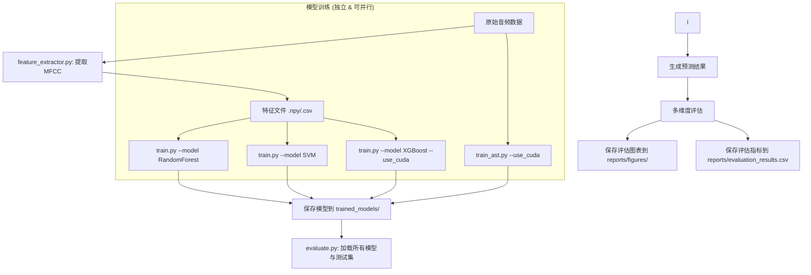

# 武器声音识别模块：构建与评估策略

本文档详细阐述了武器声音识别模块的开发流程、项目结构、关键实现细节以及多模型评估方案。

## 1. 核心目标与技术选型

**目标**: 构建一个高效的机器学习流水线，用于从原始音频中提取 MFCC 特征，并系统地训练、评估和比较多种分类模型，最终选出最优方案并进行集成。

**技术栈**:
*   **音频处理**: `librosa`
*   **数据处理**: `pandas`, `numpy`
*   **传统模型**: `scikit-learn`, `xgboost`, `lightgbm`
*   **深度学习模型**: `torch`, `transformers` (用于 AST)
*   **可视化**: `matplotlib`, `seaborn`

## 2. 项目结构规划

我们将采用纯脚本的模块化开发，不使用 Jupyter Notebooks。

```
/
├── reports/                      # 存放最终的评估结果
│   ├── figures/                  # 存放可视化的图表 (如混淆矩阵)
│   └── evaluation_results.csv    # 所有模型的量化评估指标对比
├── src/
│   └── sound_recognition/
│       ├── __init__.py
│       ├── config.py             # 配置文件 (路径, 参数等)
│       ├── dataset.py            # 数据集处理与加载
│       ├── feature_extractor.py  # MFCC 特征提取与保存脚本
│       ├── train.py              # [重构] 训练单个指定模型的脚本
│       ├── train_ast.py          # 训练 AST 模型的脚本
│       └── evaluate.py           # 评估模型并生成报告的脚本
└── trained_models/               # 存放训练好的模型文件 (.pkl, .bin)
```

## 3. 开发流水线 (Pipeline) - 优化版



## 4. 关键模块实现细节

### `src/sound_recognition/config.py`
*   定义所有路径：音频数据路径、特征保存路径、模型保存路径、报告路径。
*   定义所有超参数：音频采样率、MFCC 参数、各模型的核心超参数。

### `src/sound_recognition/dataset.py`
*   `load_audio_paths()`: 遍历声音目录，解析文件名，返回一个包含 (文件路径, 武器标签) 的列表。
*   `split_data()`: 将数据划分为训练集、验证集和测试集。
*   `AudioDataset(torch.utils.data.Dataset)`: 为 AST 模型创建一个 PyTorch 数据集类，负责加载音频、应用增广、并转换为声谱图。

### `src/sound_recognition/feature_extractor.py`
*   一个主脚本，调用 `dataset.py` 中的函数加载数据路径。
*   循环处理所有音频文件，使用 `librosa.feature.mfcc` 提取特征。
*   将提取出的 MFCC 特征（以及对应的标签）保存为 `.npy` 或 `.csv` 文件，供传统模型使用。

### `src/sound_recognition/train.py`
*   **参数化训练脚本**：使用 `argparse` 接收命令行参数，如 `--model <model_name>` 和 `--use_cuda`。
*   **模型注册表**：内部维护一个模型字典，将模型名称映射到 `scikit-learn`, `xgboost` 等库的实际模型类。
*   **CUDA 加速**：
    *   检查 `use_cuda` 标志和 CUDA 可用性。
    *   对于支持 GPU 的模型（如 XGBoost, LightGBM），自动配置 GPU 相关参数（例如 `tree_method='gpu_hist'`）。
*   **独立训练**：加载特征数据，仅训练和保存由参数指定的单个模型。

### `src/sound_recognition/train_ast.py`
*   使用 `Hugging Face Transformers` 库。
*   **CUDA 加速**：脚本将自动检测 CUDA 设备。如果可用，模型和数据将被移至 GPU (`.to('cuda')`) 以加速训练。
*   加载预训练的 `ASTForAudioClassification` 模型。
*   使用 `dataset.py` 中创建的 `AudioDataset` 来加载和预处理数据。
*   使用 `Trainer` API 进行微调训练。
*   保存性能最佳的模型 checkpoint 到 `trained_models/` 目录。

### `src/sound_recognition/evaluate.py`
*   这是我们的最终评估脚本。
*   它会加载**所有**在 `trained_models/` 中保存好的模型。
*   加载**测试集**数据。
*   对每个模型，执行预测，并计算以下指标：
    *   `accuracy`
    *   `precision` (macro)
    *   `recall` (macro)
    *   `f1-score` (macro)
*   **输出**:
    1.  **CSV 报告**: 将所有模型的上述指标保-到 `reports/evaluation_results.csv`，形成一个清晰的对比表格。
    2.  **可视化图表**: 为每个模型生成并保存**混淆矩阵**的图像 (`.png`) 到 `reports/figures/` 目录下。

## 5. 执行流程 (优化版)

1.  **特征提取**:
    *   `python -m src.sound_recognition.feature_extractor`

2.  **模型训练 (按需独立执行)**:
    *   训练随机森林: `python -m src.sound_recognition.train --model RandomForest`
    *   训练 SVM: `python -m src.sound_recognition.train --model SVM`
    *   训练 XGBoost (使用 CUDA): `python -m src.sound_recognition.train --model XGBoost --use_cuda`
    *   训练 AST (使用 CUDA): `python -m src.sound_recognition.train_ast --use_cuda`

3.  **最终评估**:
    *   (所有需要的模型训练完毕后)
    *   `python -m src.sound_recognition.evaluate`

这份详细的构建逻辑和评估方案，确保了我们的开发过程是模块化的、可复现的，并且评估结果是全面和易于比较的。每个模型的训练过程相互独立，提升了开发和调试的灵活性与效率。