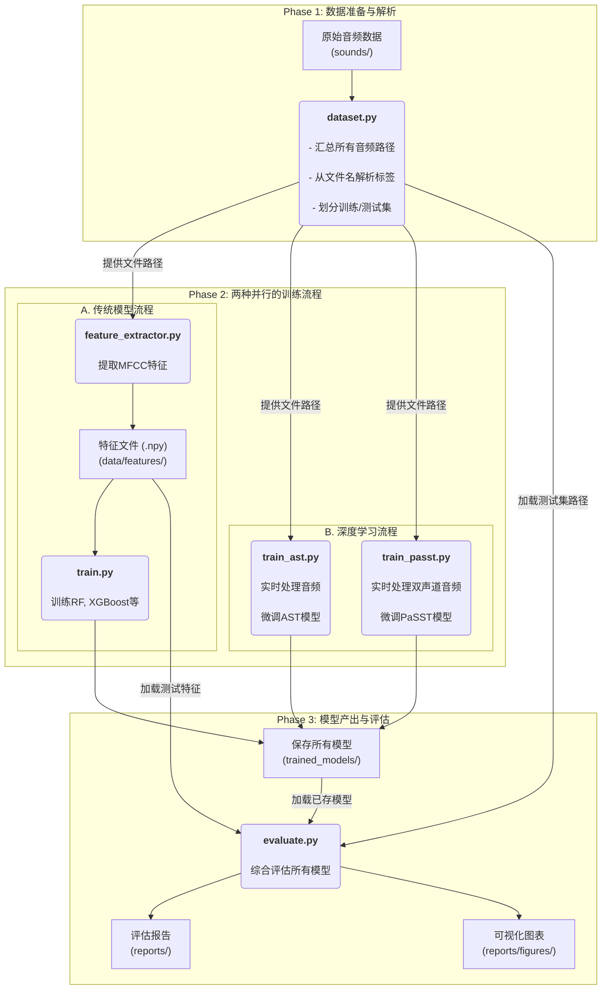

# 武器声音识别系统：架构与操作指南

本文档详细阐述了武器声音识别系统的**训练流水线**架构、各模块功能，并提供了一份完整的分步操作指南。

> 本文档主要关注**模型的训练与评估**流程。关于如何将训练好的模型部署到 Web 应用中进行**实时推理**，请参阅项目根目录下的 `README.md` 和 `WEAPON_SYSTEM_GUIDE.md`。

## 1. 系统架构概览

我们构建的是一个模块化的机器学习流水线，其核心思想是分离数据处理、模型训练和模型评估，以实现最大的灵活性和可复现性。

### 1.1. 核心组件

*   **`src/sound_recognition/config.py`**: **中央配置中心**。定义了所有文件路径（数据、模型、报告）和关键超参数（采样率、MFCC参数等），是整个系统的“大脑”。
*   **`src/sound_recognition/dataset.py`**: **数据引擎**。负责发现音频文件，从文件名中智能解析出`weapon`, `distance`, `direction`三个标签，并为传统模型和深度学习模型提供统一的数据接口。
*   **`src/sound_recognition/feature_extractor.py`**: **特征工程师**。专为传统机器学习模型服务，它加载原始音频，提取MFCC特征，对标签进行编码，并将处理好的数据保存为`.npy`格式，极大加速了后续训练。
*   **`src/sound_recognition/train.py`**: **传统模型训练器**。一个高度参数化的脚本，可以通过命令行训练多种模型（如RandomForest, XGBoost），支持单目标、多目标（方案A/B）以及交叉验证等多种训练策略。
*   **`src/sound_recognition/train_ast.py`**: **AST深度学习训练器**。利用Hugging Face Transformers库，专门用于微调先进的Audio Spectrogram Transformer (AST)模型。
*   **`src/sound_recognition/train_passt.py`**: **PaSST双声道深度学习训练器**。专门用于微调PaSST模型，通过创新的双声道处理技术，重点优化声音方位识别 (详见附录)。
*   **`src/sound_recognition/evaluate.py`**: **综合评估器**。系统的最终裁判，能够自动发现并评估所有训练好的模型（包括传统模型、AST和PaSST模型），生成详细的性能报告和可视化混淆矩阵，为模型选择提供最终依据。

### 1.2. 数据流



### 1.3. 数据集划分策略

我们的项目采用**带分层的随机抽样**策略来划分数据集，确保了模型评估的公正性和可靠性。

1.  **数据汇总**：首先，脚本会忽略`sounds/`目录下的`gun_sound_train`和`gun_sound_test`子目录结构，将所有音频文件汇集成一个统一的数据池。
2.  **按比例划分**：然后，根据`config.py`中定义的`TEST_SIZE`（默认为20%），将整个数据池划分为训练集和测试集。
3.  **动态分层抽样**：在划分过程中，我们以**预测目标**作为分层依据。这意味着，划分后的**训练集和测试集将保持与原始数据集中完全相同的预测对象类别比例**。这种策略有效避免了因纯随机划分可能导致的某些稀有类别在测试集中缺失的问题。这个分层依据可以根据当前训练任务（`weapon`, `distance`, `direction`）进行动态调整，以获得针对特定任务的最优数据分布。

这种科学的划分方法保证了模型在具有代表性的数据上进行训练，并在同样具有代表性的数据上进行评估。

## 2. 环境设置

1.  **创建Conda环境 (推荐)**
    ```bash
    conda create -n pubg_sound python=3.10
    conda activate pubg_sound
    ```

2.  **安装依赖**
    我们已将所有必要的库记录在`requirements.txt`中。请运行以下命令进行安装：
    ```bash
    pip install -r requirements.txt
    ```
    *注意：为了使用CUDA加速，请确保您已正确安装NVIDIA驱动和CUDA Toolkit，并建议安装PyTorch的CUDA版本。*

3.  **准备数据和模型**
    *   确保您的原始音频数据存放在根目录的`sounds/`文件夹下。
    *   如果您希望使用本地的AST模型，请将`config.json`, `model.safensors`, `preprocessor_config.json`文件下载到根目录的`ast_model/`文件夹下。

## 3. 分步执行指南

请在项目根目录下按顺序执行以下命令。

### 步骤 1: 特征提取 (仅传统模型需要)

此命令会处理所有音频，提取MFCC特征，并为`weapon`, `distance`, `direction`三个目标分别创建编码后的标签文件。

```bash
python -m src.sound_recognition.feature_extractor
```

### 步骤 2: 模型训练

您可以根据需求选择训练不同的模型。

**示例 1: 交叉验证RandomForest的weapon预测性能**
(用于快速评估模型，不保存最终模型)
```bash
python -m src.sound_recognition.train --model RandomForest --target weapon --cross_validate
```

**示例 2: 训练一个最终的XGBoost模型来预测distance (使用CUDA)**
```bash
python -m src.sound_recognition.train --model XGBoost --target distance --use_cuda
```

**示例 3: 训练一个多输出模型来同时预测所有目标**
```bash
python -m src.sound_recognition.train --model RandomForest --target all
```

**示例 4: 微调AST模型来预测weapon (训练10个epoch)**
```bash
python -m src.sound_recognition.train_ast --target weapon --epochs 10
```

**示例 5: 微调PaSST模型来预测声音方位 (训练10个epoch)**
```bash
python3 -m src.sound_recognition.train_passt --target direction --epochs 10
```

### 步骤 3: 综合评估

在您训练完所有希望对比的模型后，运行此最终脚本。它会自动找到所有已保存的模型（`.pkl`和AST模型目录）并进行评估。

```bash
python -m src.sound_recognition.evaluate
```

**针对性评估 (新功能):**

如果您只想评估某一类特定的模型（例如，仅评估所有PaSST模型），可以使用`--model_type`参数：

```bash
# 仅评估所有已训练的 PaSST 模型
python -m src.sound_recognition.evaluate --model_type passt

# 仅评估所有已训练的 AST 模型
python -m src.sound_recognition.evaluate --model_type ast

# 仅评估所有已训练的 scikit-learn 模型
python -m src.sound_recognition.evaluate --model_type sklearn
```

评估完成后，您将在`reports/`目录下找到`evaluation_results.csv`和所有模型的混淆矩阵图。

## 4. 模型与参数说明

我们在`train.py`中预定义了以下传统模型，关键参数如下：

*   **RandomForest**:
    *   `n_estimators=100`: 构建100棵决策树。
*   **KNN**:
    *   `n_neighbors=5`: 考虑最近的5个邻居进行投票。
*   **SVM**:
    *   `kernel='rbf'`: 使用径向基函数核，适用于非线性问题。
    *   `C=1.0`: 默认的正则化参数。
*   **SVM_GridSearch**:
    *   通过网格搜索自动寻找最佳的`C`和`gamma`参数。这是一个计算密集型但效果更好的SVM版本。
    *   `param_grid`: `{'svm__C': [0.1, 1, 10], 'svm__gamma': ['scale', 'auto']}`
*   **XGBoost**:
    *   `objective='multi:softmax'`: 用于多分类任务。
    *   `max_depth=3`: 树的最大深度，用于防止过拟合。
*   **LightGBM**:
    *   `objective='multiclass'`: 用于多分类任务。
    *   `n_estimators=200`: 构建200棵树。

## 5. 批量训练与评估

以下是一个完整的命令序列，用于训练我们定义的所有模型，并对它们进行最终的综合评估。您可以根据需要复制并执行。

### 步骤 1: 特征提取 (如果尚未执行)
```bash
# 此命令只需运行一次
python -m src.sound_recognition.feature_extractor
```

### 步骤 2: 批量训练所有模型
```bash
# --- 为目标 "weapon" 训练所有模型 ---
echo "--- Training all models for target: weapon ---"
python -m src.sound_recognition.train --model RandomForest --target weapon
python -m src.sound_recognition.train --model KNN --target weapon
python -m src.sound_recognition.train --model SVM --target weapon
python -m src.sound_recognition.train --model XGBoost --target weapon --use_cuda
python -m src.sound_recognition.train --model LightGBM --target weapon --use_cuda
python -m src.sound_recognition.train --model SVM_GridSearch --target weapon
python -m src.sound_recognition.train_ast --target weapon --epochs 10 # AST模型训练
python -m src.sound_recognition.train_passt --target weapon --epochs 10 # PaSST模型训练

# --- 为目标 "distance" 训练所有模型 ---
echo "--- Training all models for target: distance ---"
python -m src.sound_recognition.train --model RandomForest --target distance
python -m src.sound_recognition.train --model KNN --target distance
python -m src.sound_recognition.train --model SVM --target distance
python -m src.sound_recognition.train --model XGBoost --target distance --use_cuda
python -m src.sound_recognition.train --model LightGBM --target distance --use_cuda
python -m src.sound_recognition.train --model SVM_GridSearch --target distance
python -m src.sound_recognition.train_ast --target distance --epochs 10 # AST模型训练
python -m src.sound_recognition.train_passt --target distance --epochs 10 # PaSST模型训练

# --- 为目标 "direction" 训练所有模型 ---
echo "--- Training all models for target: direction ---"
python -m src.sound_recognition.train --model RandomForest --target direction
python -m src.sound_recognition.train --model KNN --target direction
python -m src.sound_recognition.train --model SVM --target direction
python -m src.sound_recognition.train --model XGBoost --target direction --use_cuda
python -m src.sound_recognition.train --model LightGBM --target direction --use_cuda
python -m src.sound_recognition.train --model SVM_GridSearch --target direction
python -m src.sound_recognition.train_ast --target direction --epochs 10 # AST模型训练
python -m src.sound_recognition.train_passt --target direction --epochs 10 # PaSST模型训练
```

### 步骤 3: 最终综合评估
```bash
# 在所有模型都训练完毕后运行
echo "--- Running final evaluation on all trained models ---"
python -m src.sound_recognition.evaluate
```


## 6. 如何扩展

*   **添加新传统模型**: 只需在`src/sound_recognition/train.py`的`get_model`函数中增加一个新的`elif`分支即可。
*   **调整超参数**: 您可以直接在`train.py`的`get_model`函数中修改模型的默认参数，或者将其改造为接收命令行参数。
*   **尝试新的深度学习模型**: 您可以参考`train_ast.py`和`train_passt.py`的结构，创建一个新的训练脚本，加载Hugging Face Hub上的其他音频模型或进行更复杂的模型改造。

---
## 7. `train_passt.py` 解析

本节详细说明了 `train_passt.py` 脚本的功能、架构设计、核心逻辑以及使用方法。

### 7.1. 脚本概述
该脚本 (`train_passt.py`) 实现了一个完整的端到端训练流程。它利用预训练的 PaSST 模型（在 AudioSet 上预训练），将其改造为支持 **双声道（Stereo）** 输入，以提取空间特征（如双耳时间差 ITD 和强度差 ILD），从而解决单声道模型无法准确识别声音方位的问题。

#### 核心特性
*   **双声道支持**：通过修改 Transformer 的 Patch Embedding 层，将左、右声道的频谱图堆叠作为输入。
*   **动态填充与截断**：自动处理不同长度的音频，并强制截断超过 10 秒的音频以防止位置编码溢出。
*   **兼容性修复**：解决了 HuggingFace Trainer 与原生 PyTorch Module 的兼容问题（如 `_keys_to_ignore_on_save`）。
*   **高效微调**：利用 Transformers 库的 `Trainer` 接口进行混合精度训练（FP16）。

### 7.2. 代码结构与核心逻辑分析

#### 7.2.1. 数据整理类 `StereoDataCollator`
负责将一个 Batch 内的数据进行预处理，使其符合模型输入要求。

*   **功能 1：长度截断 (Truncation)**
    *   **逻辑**：PaSST 模型的位置编码上限约为 10 秒（320,000 个采样点）。脚本检测音频长度，若超过 10 秒则强制截断。
    *   **目的**：防止出现 `RuntimeError: The size of tensor a (139) must match ... (99)` 错误。
*   **功能 2：动态填充 (Dynamic Padding)**
    *   **逻辑**：找出当前 Batch 中最长的音频长度，将其他音频用 0 填充至该长度。
    *   **目的**：支持变长输入，提高显存利用率。

#### 7.2.2. 模型包装类 `PaSSTForTraining` (nn.Module)
这是一个自定义的 PyTorch 模块，用于封装原始 PaSST 模型以适配 Trainer。

*   **初始化 (`__init__`)**：
    *   获取原始模型的 `mel` (预处理层) 和 `net` (Transformer 主干)。
    *   替换分类头 (`head`) 以匹配当前任务的类别数。
    *   设置 `self._keys_to_ignore_on_save = None`，解决 Trainer 保存模型时的属性缺失报错。
*   **前向传播 (`forward`) - **关键创新点****：
    1.  **拆分声道**：将输入 `[Batch, 2, Time]` 拆分为左声道和右声道。
    2.  **独立变换**：分别通过 `mel` 层提取 Log-Mel 频谱图。
    3.  **通道堆叠**：将两个单通道频谱图在 Dim 1 拼接，形成 `[Batch, 2, Freq, Time]` 的张量。
    4.  **输入网络**：送入修改过输入层的 Transformer。
    5.  **输出处理**：PaSST 默认返回 Tuple (Class Token, Distillation Token)，此处只取第一个 Class Token。

#### 7.2.3. 主函数逻辑 (`main`)

**A. 模型改造 (Model Adaptation)**
这是将单声道模型转化为双声道模型的关键步骤。

```python
# 1. 获取原始的 Patch Embedding 卷积层 (输入通道=1)
old_conv = model.net.patch_embed.proj

# 2. 创建新卷积层 (输入通道=2)
new_conv = nn.Conv2d(in_channels=2, ...)

# 3. 权重初始化策略
# 将原始权重复制两份 (一份给左声道，一份给右声道)
# 然后除以 2.0，以保持加和后的激活值幅度与原模型一致
new_weights = torch.cat([original_weights, original_weights], dim=1)
new_conv.weight = nn.Parameter(new_weights / 2.0)

# 4. 替换模型层
model.net.patch_embed.proj = new_conv
```

**B. 训练配置 (TrainingArguments)**
*   **`eval_strategy`**: 动态兼容新旧版本的 Transformers 库（自动识别是 `evaluation_strategy` 还是 `eval_strategy`）。
*   **`load_best_model_at_end=True`**: 训练结束后自动加载验证集准确率最高的模型权重。
*   **`save_total_limit=2`**: 最多只保留 2 个 Checkpoint，节省磁盘空间。

### 7.3. 输出产物

训练完成后，模型和相关文件将保存在以下目录：

*   **路径**: `./trained_models/passt_{target}_final/`
*   **内容**:
    1.  `pytorch_model.bin`: 模型的权重文件（仅包含 Transformer 部分，不包含预处理层权重，因为预处理是固定的）。
    2.  `classes.txt`: 类别名称列表（纯文本），用于推理时将 ID 映射回标签。

### 7.4. 常见问题

1.  **Warning: Input image size (...) doesn't match model**
    *   **原因**：因为使用了动态填充，输入的频谱图长度不一定是标准的 998 帧。模型会自动裁剪位置编码，不影响训练。